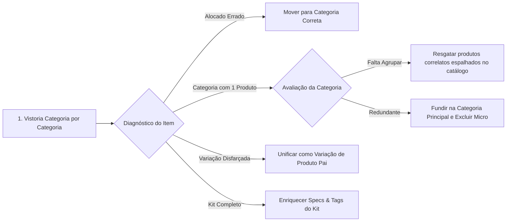
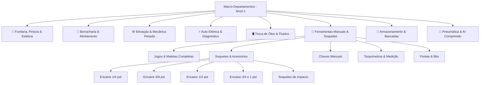

# 📋 Athena Soluções Automotivas — Roadmap & Backlog (TODO)

---

## 🔍 0. [EM EXECUÇÃO / PRIORIDADE IMEDIATA] Vistoria Geral & Auditoria Fina do Catálogo (Produto a Produto, Categoria por Categoria)

### 📌 Objetivo da Vistoria Geral
Realizar uma auditoria minuciosa, produto a produto e categoria por categoria em todo o catálogo da Athena (~640 produtos e ~50 categorias), respondendo a cinco perguntas fundamentais:
1. **Qual produto está no lugar errado?** (Ex: item de freio ou bateria perdido em ferramentas genéricas, macacos ou suportes dentro de elevadores automotivos).
2. **Para onde cada produto deve ser movido?** (Mapear a origem e o destino exato de cada item desalocado).
3. **Quais categorias deveríamos unificar utilizando outro nome?** (Eliminar micro-categorias redundantes de 1 a 2 produtos e unificá-las em famílias técnicas com nomes comerciais claros e fortes para SEO).
4. **Categorias com apenas 1 produto — Investigação profunda:**  
   - *O produto está no lugar errado e deveria estar em outra categoria já existente?*  
   - *A categoria é válida, mas há outros produtos espalhados pelo catálogo que deveriam estar agrupados com ela?*  
   - *Ou essa categoria deve ser absorvida e extinta?*
5. **Quem é Produto Único, quem é Kit Fechado e quem é Variação?**  
   - Identificar produtos que foram cadastrados repetidos apenas por causa de milímetro/tamanho/cor para fundir como **Variações**.  
   - Identificar composições completas (como o kit de 178 peças) para classificar como **Kits/Jogos** com especificações ricas e tags de alta conversão.

---

### 📋 Metodologia de Execução da Vistoria



### 📝 Checklist de Ações da Vistoria Geral:
- [x] **0.1 Mapeamento Completo de Volume:** Gerar levantamento de todas as categorias do banco com o número exato de produtos em cada uma (identificando todas as categorias com 0, 1, 2 e 3 produtos).
- [x] **0.2 Investigação das Categorias Solitárias (1 a 3 produtos):**
  - Auditar cada produto solitário para determinar se está em local incorreto ou se há itens irmãos dispersos em outras categorias.
- [x] **0.3 Descentralização da Categoria "Ferramentas & Armários" (321 produtos):**
  - Fatiar a macro-categoria sobrecarregada, criando a categoria dedicada *Estética Automotiva & Pintura* (81 itens) e migrando as 26 parafusadeiras industriais.
- [x] **0.4 Descentralização da Categoria "Acessórios Diversos" (36 produtos):**
  - Mover cada um dos produtos para suas respectivas famílias especializadas (Elevação, Soquetes, Torquímetros, Válvulas, Lubrificação).
- [x] **0.5 Proposta de Unificação e Renomeação:**
  - Elaborar proposta com a relação completa de: *Categoria Atual ➔ Nova Categoria Unificada / Novo Nome Comercial*.
- [x] **0.6 Relatório de Movimentação para Validação & Execução:**
  - Execução no banco oficial Supabase com eliminação de todas as micro-categorias de 0 a 1 produto e criação de Estética Automotiva.

---

## 🚀 1. [CONCLUÍDO] Sistema de Variações de Produtos (Cores, Tamanhos, Modelos & Integração Omie)

### 📌 Contexto & Motivação
- Existem equipamentos (como carrinhos de oficina, bancadas, alinhadores, scanners) cuja única diferença entre itens físicos é a **cor** (ex: Vermelho, Azul, Preto) ou o **tamanho/especificação** (ex: 5 gavetas vs 7 gavetas, 220V vs 380V, 1.500mm vs 2.000mm).
- Em vez de cadastrar 3 a 5 produtos separados e poluir o catálogo com itens repetidos, unificamos em **1 produto pai** com **variações selecionáveis**.
- No **Omie ERP**, cada variação física possui seu próprio cadastro com código SKU e estoque individualizado.

---

### 🧠 Regras de Negócio & Fallbacks Inteligentes

| Atributo | Comportamento se Preenchido | Comportamento se NÃO Preenchido (Fallback) |
| :--- | :--- | :--- |
| **Preço (`price`)** | Cobra o valor específico da variação selecionada. | **Herda automaticamente o preço base do produto pai**. |
| **Imagem (`image`)** | Ao clicar na variação, a galeria/foto principal troca para a imagem daquela opção. | **Mantém a imagem e galeria principal do produto pai** (nada quebra). |
| **Estoque Omie** | Consulta o saldo em estoque no Omie via `sku` / `omieCode` da variação. | Se não encontrar no ERP ou não tiver saldo, **define estoque como 0** (esgotado). |
| **Identificação Omie** | Cada variação guarda seu `sku` e `omieCode` exclusivos. | Permite que o checkout e a nota fiscal no Omie saiam com a baixa no produto exato. |

---

### 🎨 Design & Experiência do Usuário (UI / UX)

#### 1. Tipos de Seletores Dinâmicos:
- **Variações de Cor (Swatches):**
  - Círculos de 28–32px preenchidos com a cor real (`colorHex`).
  - Anel de destaque na cor ativa (borda dupla âmbar/escuro).
  - Rótulo logo acima: `Cor: [Nome da Cor Selecionada]`.
- **Variações de Tamanho / Medida / Modelo (Pills / Chips):**
  - Botões arredondados modernos (ex: `[ 5 Gavetas ]`, `[ 7 Gavetas ]` ou `[ 220V ]`, `[ 380V ]`).
  - Efeito visual de botão ativo e hover suave.

#### 2. Na Página de Detalhes ([ProductDetailPage.jsx](src/pages/ProductDetailPage.jsx)):
- Bloco posicionado estrategicamente entre o título do produto e a caixa de preço/botões de compra.
- Ao clicar em uma opção:
  - Foto principal muda instantaneamente (se houver foto para a variação).
  - Preço e parcelamento recalculam (se houver preço diferente).
  - Status de estoque exibe a quantidade disponível daquela variação.
  - Botão do WhatsApp gera a mensagem incluindo a variação escolhida:
    > *"Olá Athena! Tenho interesse no Carrinho de Oficina na cor **Vermelho (SKU: WLF-CAR-VM)**..."*

#### 3. No Card do Catálogo ([ProductCard.jsx](src/components/ProductCard.jsx)):
- Mini-swatches (bolinhas) discretas indicando que o produto tem cores disponíveis.
- Passar o mouse sobre a bolinha já pode alternar a foto do card (estilo lojas premium).

#### 4. No Carrinho de Compras ([CartContext.jsx](src/context/CartContext.jsx)):
- O item adicionado ao carrinho salva:
  - `productId`, `variantId`, `variantName` (ex: "Vermelho - 5 Gavetas").
  - `sku` da variação.
  - Imagem e preço calculados.
- Na listagem do carrinho e no resumo do pedido, aparece discriminada a opção escolhida.

#### 5. No Painel Administrativo ([AdminPanel.jsx](src/components/AdminPanel.jsx)):
- Seção no modal/formulário de edição do produto: **"Variações do Produto (Cores / Tamanhos)"**.
- Botão **"+ Adicionar Variação"** com campos:
  - Nome da Variação (ex: "Vermelho", "7 Gavetas", "220V").
  - Código SKU Omie (obrigatório para integração de estoque).
  - Código Omie numérico (opcional).
  - Seletor de Cor HEX (opcional — se informado, vira bolinha de cor; se vazio, vira botão de texto).
  - Preço Diferenciado (opcional — em branco herda o valor geral).
  - URL da Imagem da Variação (opcional — em branco herda a foto geral).

---

### 📦 Exemplo de Estrutura de Dados (JSON / Supabase)

```json
{
  "id": "prod_carrinho_oficina_modular",
  "name": "Carrinho de Ferramentas Modular Wolfcar",
  "slug": "carrinho-de-ferramentas-modular-wolfcar",
  "price": 1499.00,
  "image": "https://pub-fd5d45a1dd144e14aa81b6a686385df9.r2.dev/produtos/carrinho-geral.webp",
  "categoryId": "cat_ferramentas",
  "brandId": "brand_wolfcar",
  "variants": [
    {
      "id": "var_vermelho_5g",
      "name": "Vermelho - 5 Gavetas",
      "sku": "WLF-CAR-VM-5G",
      "omieCode": 892011,
      "colorHex": "#DC2626",
      "image": "https://pub-fd5d45a1dd144e14aa81b6a686385df9.r2.dev/produtos/carrinho-vermelho.webp"
    },
    {
      "id": "var_azul_5g",
      "name": "Azul - 5 Gavetas",
      "sku": "WLF-CAR-AZ-5G",
      "omieCode": 892012,
      "colorHex": "#1E40AF",
      "image": "https://pub-fd5d45a1dd144e14aa81b6a686385df9.r2.dev/produtos/carrinho-azul.webp"
    },
    {
      "id": "var_preto_7g",
      "name": "Preto - 7 Gavetas",
      "sku": "WLF-CAR-PR-7G",
      "omieCode": 892013,
      "colorHex": "#18181B",
      "price": 1799.00
    }
  ]
}
```

---

### 📝 Checklist de Tarefas para Execução

- [x] **1.1 Modelo & Banco:** Suporte completo ao campo `variants` (JSONB) no Supabase / PostgreSQL e fallbacks estruturados (`sku`, `omieCode`, `price`, `stock`, `colorHex`, `image`).
- [x] **1.2 Backend (Omie Sync & Webhooks):** Atualizar o serviço de consulta de estoque e sincronização (`omieProductSyncService.js` / `server.js`) para suportar baixa e saldo por SKU de variação.
- [x] **1.3 ProductDetailPage:** Seletor dinâmico estilo Shopee (`selectedVariant`) com suporte a cores e chips, fallbacks de imagem e preço, estoque individualizado e atualização da mensagem WhatsApp.
- [x] **1.4 CartContext & Checkout:** Atualizar `addToCart` para persistir `variantId`, `variantName`, `sku`, `price` e `image`.
- [x] **1.5 ProductCard:** Exibir swatches de cores / badges de opções no catálogo com pré-visualização.
- [x] **1.6 AdminPanel & ProductVariantsManager:** Gerenciador visual dedicado de variações no formulário de produtos com vínculo direto a SKUs e códigos Omie.
- [x] **1.7 Hermes API & Brain (`../athena-hermes`):** Ensinar o Hermes Agent a consultar, entender e atualizar variações (`hermesProductService.js`, `athena-catalogo-fidelidade/SKILL.md`, `athena-site/SKILL.md`, `athena_api.py`, `SOUL.md`).

---

## ⚡ 2. [CONCLUÍDO] Otimização de Carga e Modularização do God File (`AdminPanel.jsx`)

### 📌 Contexto & Diagnóstico
- `AdminPanel.jsx` atingiu 11.264 linhas de código em um único arquivo, gerando um bundle massivo de 2.6 MB sem code-splitting.
- O `ImageLibraryModal` executava varreduras pesadas em 600 produtos mesmo quando fechado.
- Ausência de lazy loading fazia o usuário carregar toda a estrutura administrativa na página inicial pública.

### 📝 Checklist de Tarefas
- [x] **2.1 Blindagem do ImageLibraryModal:** Impedir cálculos pesados de `mediaUsageRegistry` quando `isOpen === false`.
- [x] **2.2 Code Splitting com React.lazy:** Carregar o `AdminPanel` sob demanda com `React.Suspense` e skeleton de carregamento profissional.
- [x] **2.3 Otimização do Rollup / Vite Chunks:** Dividir dependências pesadas (`vendor-react`, `lucide`, etc.) para cache eficiente no navegador.
- [x] **2.4 Modularização do AdminPanel:** Extrair modais e abas gigantes (`ProductFormModal`, `ProductVariantsManager`, `OmieSyncTab`, `ClientsManagementTab`, etc.) em submódulos limpos em `src/components/admin/`.
- [x] **2.5 Keep-alive & Mitigação de Cold Start:** Otimizar rotas e pings de aquecimento para evitar telas congeladas.

---

---

## 🕶️ 3. [BACKLOG / FUTURO] Visualização 3D Interativa & Realidade Aumentada (WebAR)

### 📌 Contexto & Objetivo
- Permitir que proprietários de oficinas e concessionárias visualizem equipamentos (elevadores, bancadas modulares, carrinhos de ferramentas) em **escala real (1:1)** no espaço físico da sua oficina usando a câmera do celular (iOS e Android), sem precisar instalar aplicativos.
- No computador (desktop), exibir visualizador 3D 360° interativo com botão/QR Code para abrir no celular.

### 📱 Tecnologias & Formatos Recomendados
- **Biblioteca Web:** `<model-viewer>` do Google (leve, nativa para navegadores mobile).
- **Formatos de Arquivo:**
  - Android: `.glb` (carregado via Scene Viewer nativo).
  - iOS (iPhone/iPad): `.usdz` ou `.glb` com conversão/fallback via Quick Look.
- **Armazenamento:** Arquivos 3D hospedados no Cloudflare R2 ou Cloudinary CDN.

### 🛠️ Métodos para Obtenção dos Modelos 3D (Sem custos abusivos)
1. **Modelos CAD dos Fabricantes:** Solicitar arquivos `.step` ou `.obj` às montadoras parceiras (Wolfcar, Engecass, Sigma Tools, Marcon) e converter para `.glb` no Blender.
2. **Fotogrametria no Galpão / Oficina:** Usar o celular com apps como *Polycam*, *Luma AI* ou *Kiri Engine* girando em volta do produto físico montado para gerar a malha com texturas reais.
3. **IAs Image-to-3D:** Ferramentas gratuitas/freemium como Tripo3D, Rodin ou Meshy (exportação `.glb`).
4. **Modeladores Freelancers:** Para chaparias retas de oficinas (muito barato, R$ 80 - R$ 150 por peça).

### 📐 Calibração de Escala
- Para projeção fiel no chão (AR 1:1), a altura/largura da malha deve corresponder a 1 unidade = 1 metro.
- Script ou atributo `scale` no `<model-viewer>` com base nas medidas da ficha técnica.

---

## 📌 4. Outras Melhorias & Tarefas Futuras do Backlog

- [ ] **Sincronização Bidirecional via Webhooks do Omie:** Receber atualizações de estoque e preço do Omie em tempo real via webhook HTTP.
- [ ] **Cálculo de Frete Automatizado:** Integração com Melhor Envio / Correios / Transportadoras para cotação em tempo real na página do produto.
- [ ] **Exportação de Relatórios de Vendas / Cotações:** Download de orçamentos e pedidos em PDF para envio formal a oficinas e concessionárias.
- [ ] **Otimização Contínua de SEO:** Gerar automaticamente dados estruturados Schema.org `hasVariant` para o Google Shopping indexar cada variação.

---

## 🗂️ 5. [CONCLUÍDO] Saneamento, Reclassificação e Otimização de Categorias de Produtos

### 📌 Diagnóstico da Situação Inicial
- **Total de produtos auditados:** 727
- **Total de categorias cadastradas:** 51 ➔ Reduzidas para 46 com eliminação de redundâncias e micro-categorias.
- **Problema central resolvido:** 81 produtos de Estética Automotiva e 26 parafusadeiras desmembrados de `cat_ferramentas`. Itens de macacos resgatados de Elevadores.
- **Produtos órfãos:** 4 produtos vinculados às suas categorias corretas.
- **Categorias solitárias (0 a 1 produto):** Reduzidas a 0!

---

### 📝 Checklist Detalhado para Execução

#### Fase 1: Correções Críticas & Imediatas
- [x] **1.1 Vincular os produtos órfãos:**
  - `prod_omie_11876439233` ("PASTA VEGETAL DE MONTAGEM E DESMONTAGEM") ➔ Vinculado a `cat_desmontadoras`.
  - `prod_omie_11929046930` ("PROGRAMADOR SENSOR TPMS VENU 90") ➔ Vinculado a `cat_1789998064578` (*Válvulas/TPMS*).
  - `prod_omie_11876016891` ("ELEVADOR GANGORRA 1.5TON PORTATIL") ➔ Vinculado a `cat_elevadores` (*Elevadores*).
  - `prod_omie_11880776500` ("JG CHAVE HEXALOBULAR TIPO CANIVETE C/08 PECAS") ➔ Vinculado a `cat_1789405752776` (*Soquetes*).
- [x] **1.2 Excluir categoria vazia:**
  - Excluída `cat_1789413312442` ("Canetas para testes e diagnósticos", slug: `canetas-para-testes-e-diagnosticos`) com 0 produtos.
- [x] **1.3 Correção de título com prompt de imagem:**
  - Corrigido `prod_mahovi_mah-6004`: de `"tire o qr code, o texto descrição e redimensione para 1200x1200 - Mahovi MAH-6004"` ➔ `"Balanceadora de Rodas Computadorizada Linha Leve - Mahovi MAH-6004"`.

#### Fase 2: Fusão e Exclusão de Micro-Categorias Redundantes (1 a 3 produtos)
- [x] **2.1 Apertadeira de rodas (1 produto):**
  - Movido `prod_sigma_sgt-7530` ("Apertadeira de Rodas 1\" 1.500 Nm 24V") ➔ `cat_1788453768939` (*Chaves de impacto*).
  - Excluída categoria `cat_1789067041029`.
- [x] **2.2 Transmissão Automática (1 produto):**
  - Movido `prod_delta_dt-mft01` ("Máquina para Troca de Fluido da Transmissão Automática") ➔ `cat_1788371138282` (*Troca de fluido*).
  - Excluída categoria `cat_1789670494368`.
- [x] **2.3 Fumaça & Nitrogênio (2 produtos):**
  - Movido `prod_mahovi_mah4040_fumaca` ("Gerador de Fumaça para Vazamentos") ➔ `cat_scanners` (*Scanners & Diagnóstico*).
  - Movido `prod_mahovi_mah-4014` ("Máquina de Calibragem c/ Nitrogênio 70L") ➔ `cat_1790016852133` (*Calibradores e Medidores*).
  - Excluída categoria `cat_1788376758844`.
- [x] **2.4 Endoscópios e Boroscópios (1 produto):**
  - Movido `prod_1790341413049` ("Câmera Sonda Endoscópio/Boroscópio USB Tipo-C") ➔ `cat_scanners` (*Scanners & Diagnóstico*).
  - Excluída categoria `cat_1790341326840`.
- [x] **2.5 Extensão para controle de torque (1 produto):**
  - Movido `prod_1789406547431` ("Kit Extensões para Controle de Torque 1/2″") ➔ `cat_1789075823822` (*Torquímetro*).
  - Excluída categoria `cat_1789406515276`.
- [x] **2.6 Suporte para Motor:**
  - Resgatado `prod_1790178303116` ("Suporte para Motor 450 kg") preso em `cat_elevadores` e unificado com `prod_1790178643434` ("Suporte para Motor 600 kg") em `cat_1790178421551`.

#### Fase 3: Descentralização de Produtos Mal Alocados
- [x] **3.1 Limpar Macacos da Categoria Elevadores:**
  - Movidos 5 macacos Sigma (`prod_sigma_sgt-3035`, `sgt-3040`, `sgt-3050`, `sgt-2025`, `sgt-2030`) ➔ `cat_1789587656316` (*Macaco Hidráulico*).
- [x] **3.2 Redistribuir itens desalocados de "Acessórios diversos":**
  - Guincho 2T (`prod_1790179415072`) e Cavaletes (`prod_lapek_lpk-sup`) ➔ *Macaco Hidráulico*.
  - Saca Núcleo e Tampas de Válvula (`LPK-50033`, `50035`, `50036`, `50037`, `50038`) ➔ *Válvulas para pneus*.
  - Alicate Balanceador (`LPK-50039`) ➔ *Desmontadoras & Balanceadoras*.
  - Jogo de Soquetes 46 Peças (`prod_delta_dt-jsq01`) ➔ *Soquetes*.
  - Saca Polia e Sacador GDI (`0699930039`, `DT-SAC07`) ➔ *Ferramentas de extração*.
  - Funis e Seringas de Óleo/Fluido ➔ *Troca e Coleta de Óleo*.
  - Medidor Angular de Torque (`DT-MAT01`) ➔ *Torquímetro*.
  - Kit Limpeza de Bicos (`DT-ADA01`) ➔ *Limpador e Testador de Injetores*.
  - Auxiliar SKX-018 e Cabo OBD Bateria (`DT-ATB01`) ➔ *Teste de bateria*.
  - Tapetes Antiderrapantes (`prod_mahovi_wal-4020`) ➔ *Elevadores*.
- [x] **3.3 Descentralizar itens específicos de "Ferramentas & Armários":**
  - 81 produtos migrados para a nova categoria dedicada **Estética Automotiva & Pintura** (`cat_estetica_pintura`).
  - 26 parafusadeiras industriais migradas para **Parafusadeira & Desparafusadeira** (`cat_1789409045834`).
- [x] **3.4 Descentralizar itens de "Ferramentas Automotivas" e "Ferramentas de Extração":**
  - Calibrador Digital (`prod_mahovi_mah-5010`) ➔ *Calibradores e Medidores*.
  - Carregador SKX-038 ➔ *Teste de bateria*.
  - Detector de Continuidade SKX-088 ➔ *Scanners & Diagnóstico*.
  - Visor ATF (`prod_1788380306494`) ➔ *Troca de fluido*.
  - Trolley Veículos MAH-103 ➔ *Macaco Hidráulico*.
  - Kit Êmbolo Freio e Molas de Freio ➔ *Sistema de freios*.
  - Encolhedor de Molas e Extrator de Terminais ➔ *Suspensão e Direção*.
  - Reset Powershift DPS6 ➔ *Embreagem e Transmissão*.
  - Extratores de Bicos Diesel ➔ *Limpador e Testador de Injetores*.
  - Spring Lock Ar Condicionado ➔ *Ferramentas para Ar Condicionado*.

---

## 🛒 6. [ARQUITETURA DE CATÁLOGO & UX] Sistema Hierárquico de Categorias, Subcategorias e Filtros Facetados (Inspirado no Modelo KaBuM!)

### 📌 Diagnóstico & Motivação
- Atualmente o site conta com **cerca de 50 categorias planas (flat taxonomy)**.
- **Problema de UX:** Uma lista com 50 opções no cabeçalho ou menu mobile polui a visão do cliente, gera o "paradoxo da escolha" e dificulta encontrar produtos específicos rapidamente.
- **Inspirador:** A estrutura da **KaBuM!**, **Amazon** e **Mercado Livre**, onde existem **poucos Macro-Departamentos visíveis** (ex: *Hardware*, *Periféricos*, *Gamer*), e dentro deles se desdobram **Subcategorias (Nível 2)** e **Sub-subcategorias (Nível 3)**, acompanhadas de uma **barra lateral de filtros facetados dinâmicos** (Marca, Encaixe, Voltagem, Preço, Tipo de Ponta).

---

### 🔍 Estudo de Caso: Composição do Kit de Ferramentas / Soquetes

#### 1. Identificação do Produto
A lista fornecida pelo cliente detalha com precisão a composição clássica de um **Jogo de Soquetes e Ferramentas Profissional de 178 Peças com Maleta (Encaixes 1/4", 3/8" e 1/2")** (padrão consagrado por montadoras e marcas premium como Gedore Red, Chiaperini/Titanium, Robust e Vonder):

- **Pontas Bits (Encaixe 5/16" - 24 peças):** Hexagonais (7 a 14mm), Phillips (PH3 e PH4), Fenda (8 a 12mm), Torx (T40 a T70) e Torx c/ Guia (T40 a T70).
- **Chaves Manuais (30 peças):** 9 Chaves L Hexagonais abauladas (1,5 a 10mm), 9 Chaves L Torx (T10 a T50) e 12 Chaves Combinadas c/ Catraca Reversível (8 a 19mm).
- **Soquetes & Acessórios 1/4" (64 peças):** Curtos (4 a 14mm), Longos (4 a 10mm), Torx Fêmea (E4 a E8), Chaves Soquete (Hex, PH, Fenda, Torx, Torx Guia, Multidentadas XZN M8/M10/M12) e Acessórios (Catraca, Extensões, Junta, Cabos).
- **Soquetes & Acessórios 3/8" (28 peças):** Curtos (10 a 19mm), Longos (10 a 15mm), Soquete de Vela 18mm, Torx Fêmea (E10 a E18) e Acessórios.
- **Soquetes & Acessórios 1/2" (32 peças):** Curtos (10 a 32mm), Longos (16 e 18mm), Impacto Liga Leve (17, 19 e 21mm), Soquetes de Vela (16 e 21mm), Torx Fêmea (E20 e E24) e Acessórios (Catraca, Extensões 5" e 10", Junta, Cabos).

#### 2. Entendimento Estratégico (Kit vs Variação vs Peça Avulsa)
- **Não é uma variação de um único parafuso/chave:** É um **Kit Completo (Jogo Fechado)** com SKU próprio no Omie ERP.
- **Onde entra o sistema de Variações:** Se o fornecedor oferecer a maleta em diferentes tamanhos/quantidades de peças (ex: *Maleta 94 peças*, *Maleta 150 peças*, *Maleta 178 peças*, *Maleta 216 peças*), aí sim teremos 1 produto pai com seletor de variação por quantidade de peças!
- **Peças Avulsas:** Chaves individuais (ex: Chave Combinada com Catraca) continuam existindo como produtos com variação de medida (8mm, 10mm, 13mm, 17mm, 19mm) para quem perdeu uma peça ou precisa só de uma medida específica.

#### 3. Oportunidade no Hermes Agent (Upselling & Resposta Técnica Cirúrgica)
- Quando o Hermes indexa a composição interna desse kit, se um cliente perguntar:
  > *"Vocês têm soquete Torx fêmea E14 ou soquete de vela 16mm?"*
- O Hermes pode responder com inteligência consultiva:
  > *"Temos sim! Temos tanto a peça avulsa por R$ X quanto o nosso **Jogo Completo de Soquetes de 178 Peças com Maleta**, que já vem com o E14, os soquetes de vela de 16mm e 21mm, mais 3 catracas e chaves combinadas com catraca de 8 a 19mm!"*

---

### 🏛️ Nova Arquitetura de Categorias Hierárquicas (Modelo KaBuM!)

Em vez de 50 categorias na cara do cliente, o catálogo passa a ter **6 a 8 Macro-Departamentos**, com subcategorias e sub-subcategorias expansíveis:



#### Mapeamento Detalhado dos Departamentos & Subcategorias:

1. **🚗 Funilaria, Pintura & Estética Automotiva:**
   - **Subcategorias:** Repuxadeiras & Solda (Spotters), Politrizes & Lixadeiras, Pistolas de Pintura & Airless, Tornadores & Higienização, Acessórios & Consumíveis.
2. **🛞 Borracharia, Pneus & Alinhamento:**
   - **Subcategorias:** Alinhadores de Direção (3D / Laser), Balanceadoras de Rodas, Desmontadoras de Pneus, Calibradores & Válvulas TPMS, Tartarugas & Vulcanização.
3. **⚙️ Elevação & Mecânica Pesada:**
   - **Subcategorias:** Elevadores Automotivos (2 colunas, 4 colunas, tesoura), Macacos Hidráulicos (Jacaré, Garrafa, Transmissão), Prensas Hidráulicas, Guinchos & Cavaletes, Suportes para Motores.
4. **⚡ Auto Elétrica, Diagnóstico & Injeção:**
   - **Subcategorias:** Scanners Automotivos & Diagnóstico, Testadores & Carregadores de Bateria, Limpeza & Teste de Injetores, Osciloscópios & Detectores de Vazamento (Fumaça), Câmeras Endoscópicas.
5. **🛢️ Troca de Óleo, Fluidos & Lubrificação:**
   - **Subcategorias:** Máquinas de Troca de Fluido de Câmbio (ATF), Pingadeiras & Coletores de Óleo, Propulsoras de Graxa & Bombas Pneumáticas, Funis, Seringas & Medidores.
6. **🔧 Ferramentas Manuais & Soquetes:**
   - **Subcategorias:** Jogos & Maletas Completas (Kits 178p, 216p, etc.), Soquetes & Acessórios (1/4", 3/8", 1/2", Impacto), Chaves Manuais (Catraca, Combinadas, Torx, Allen, Fenda/PH), Torquímetros & Goniômetros, Pontas, Bits & Adaptadores, Ferramentas Especiais de Sincronismo & Extração.
7. **🧰 Armazenamento & Organização de Oficina:**
   - **Subcategorias:** Carrinhos de Ferramentas (com/sem gavetas, bandejas), Bancadas de Trabalho & Painéis Perfurados, Armários & Gaveteiros Modulares.
8. **💨 Pneumática & Ar Comprimido:**
   - **Subcategorias:** Chaves de Impacto Pneumáticas, Parafusadeiras Pneumáticas, Compressores de Ar & Reservatórios, Mangueiras, Filtros & Engates Rápidos.

---

### 🎛️ Filtros Facetados Dinâmicos na Barra Lateral (Estilo KaBuM!)

Para evitar criar categorias infinitas para cada detalhe técnico, a página de listagem ganha **filtros inteligentes acumulativos**:

| Filtro Facetado | Opções de Seleção Dinâmica |
| :--- | :--- |
| **Encaixe** | `1/4"`, `3/8"`, `1/2"`, `3/4"`, `1"` |
| **Perfil da Ponta** | `Sextavado`, `Torx (Macho)`, `Torx Fêmea (E)`, `XZN Multidentado`, `Allen (Hexagonal)`, `Phillips (PH)`, `Fenda Simples` |
| **Tipo de Item** | `Jogo / Maleta Completa`, `Peça Avulsa`, `Acessório (Catraca, Extensão, Cabo)` |
| **Material / Acabamento** | `Cromo Vanádio (Cr-V)`, `Cromo Molibdênio (Impacto)`, `Aço Fosfatizado` |
| **Alimentação** | `Manual`, `Pneumático`, `Elétrico 220V`, `Elétrico 110V`, `Bateria (18V / 20V)` |
| **Marca** | `Gedore Red`, `Sigma Tools`, `Mahovi`, `Wolfcar`, `StarkX`, `Delta`, `Lapek`, `Chiaperini` |
| **Faixa de Preço** | Slider / Checkbox: *Até R$ 100*, *R$ 100 - R$ 500*, *R$ 500 - R$ 2.000*, *Acima de R$ 2.000* |
| **Disponibilidade** | `Pronta Entrega (Em Estoque)`, `Sob Encomenda` |

---

### 📝 Checklist de Implementação da Arquitetura Hierárquica

- [ ] **6.1 Modelo de Dados (Supabase / Postgres):**
  - Adicionar colunas `parent_id` (UUID/String apontando para a categoria pai) e `level` (1=Departamento, 2=Subcategoria, 3=Sub-subcategoria) na tabela `categories`.
  - Criar índice para busca rápida por hierarquia (`CREATE INDEX idx_categories_parent_id ON categories(parent_id);`).
- [ ] **6.2 Backend API:**
  - Criar rota `GET /api/categories/tree` que devolve a árvore hierárquica já aninhada para montagem rápida do menu.
  - Atualizar endpoint de produtos para filtrar recursivamente (ao selecionar um Departamento pai, trazer todos os produtos de suas subcategorias).
- [ ] **6.3 Frontend — Menu Megamenu / Drawer Mobile:**
  - Criar componente de Megamenu no desktop (hover no departamento abre as subcategorias em colunas limpas).
  - No mobile, menu estilo acordeão multinível com botão voltar suave.
- [ ] **6.4 Frontend — Barra Lateral de Filtros (Faceted Search):**
  - Implementar componente `FacetedFilterSidebar.jsx` na página de categorias com contadores dinâmicos de produtos por filtro (ex: `Encaixe 1/2" (45)`).
- [ ] **6.5 Breadcrumb Inteligente:**
  - Exibir trilha de navegação clicável na página do produto: `Home > Ferramentas Manuais > Soquetes & Acessórios > Maletas e Jogos > Produto`.
- [ ] **6.6 Hermes Agent Brain & Skills:**
  - Atualizar as skills do Hermes (`athena-catalogo-fidelidade` e `athena-site`) para compreender a nova taxonomia em árvore e sugerir kits completos com base na composição de peças.

---

## 🧠 7. [IA & ASSISTENTE ADMIN] Evolução do Sistema Inteligente de Cadastro e Parser Semântico de Produtos (Independente do Hermes)

> [!IMPORTANT]
> **Divisão Clara de Responsabilidades:**  
> O **Hermes Agent** é estritamente o atendente conversacional no WhatsApp (CRM/Vendas), cuja função é apenas **consultar** o catálogo existente para responder a clientes.  
> O Hermes **NÃO gera nomes, títulos, descrições ou cadastros de produtos**.  
> Para a geração e padronização inteligente de produtos no painel administrativo, será utilizado um **Motor de IA Dedicado de Backoffice (Google Gemini / OpenAI)** totalmente desacoplado do Hermes.

### 📌 Diagnóstico: Por que o Sistema Atual Falhou ao Ler a Composição?
1. **Regras Estáticas vs. Inteligência Semântica:**  
   O sistema atual dentro de `AdminPanel.jsx` (`isLineASectionHeader`, `detectAllSectionsInDescription`, `optimizeDescriptionAndSpecs`) opera 100% à base de expressões regulares lineares (regex) e listas fixas de palavras-chave. Ele não possui um modelo de linguagem (LLM como Google Gemini) conectado nem inteligência de raciocínio de contexto.
2. **Fragmentação de Cabeçalhos Markdown (Falta de Hierarquia H2/H3):**  
   Quando o usuário colou `## Composição do Kit` seguido de vários subcabeçalhos `### Pontas Bits...`, `### Chaves...`, `### Soquetes...`, o parser tratou cada `###` como uma nova seção plana independente de nível 1, desmembrando o kit em 5 abas soltas e confusas em vez de manter uma única aba limpa de "Itens Inclusos / Composição".
3. **Incapacidade de Agregação e Raciocínio Numérico:**  
   O sistema não consegue ler `05 pontas...`, `04 pontas...`, `13 soquetes...` e somar os valores para deduzir que se trata de uma **Maleta/Jogo com 178 peças**.
4. **Filtro de Especificações Restrito:**  
   O extrator de `specs` só procura grandezas físicas genéricas (`LxAxP mm`, `kg`, `220V`, `psi`, `m³`). Ele ignora termos de ferramentas manuais como encaixes (`1/4"`, `3/8"`, `1/2"`), perfis (`Torx`, `XZN`, `Sextavado`), acabamento (`Cr-V`), chaves com catraca reversível e soquetes de impacto para liga leve.
5. **Ausência de Geração Semântica de Tags e SEO:**  
   Não são inferidas tags automáticas essenciais para busca como `jogo de soquetes`, `maleta de ferramentas`, `178 pecas`, `catraca reversivel`, `soquete torx`, prejudicando o buscador interno da loja e o ranqueamento no Google.

---

### 🚀 Plano de Evolução em 2 Camadas (Assistente de Cadastro do Admin):

#### Camada 1: Heurística / Parser Algorítmico Especializado em Ferramentas (Offline, Instantâneo & Sem Custo)
- **Suporte a Cabeçalhos Hierárquicos (Subseções H2 ➔ H3):**  
  Identificar que subcabeçalhos `###` dentro de uma seção de composição pertencem à mesma aba pai, agrupando tudo com subtítulos em negrito e marcadores alinhados.
- **Kit Piece Aggregator (Somador de Peças de Kits):**  
  Algoritmo que percorre linhas iniciadas por quantidades (`• 05...`, `• 12...`, `13...`) e calcula a soma total das peças. Se a soma for superior a 10 peças, exibe o card inteligente:  
  *💡 Detectamos que este produto é um **Kit/Jogo de Ferramentas com 178 peças**.*
- **Extrator Especializado de Especificações de Ferramentas:**  
  Extrair automaticamente para a tabela de especificações:
  - `Quantidade de Peças: 178 peças`
  - `Encaixes: 1/4", 3/8" e 1/2"`
  - `Catracas Reversíveis: 3 unidades (1/4", 3/8" e 1/2")`
  - `Chaves com Catraca: 12 peças (8 a 19 mm)`
  - `Perfis: Sextavado, Torx Macho e Fêmea (E), XZN Multidentado, Hexagonal, Phillips e Fenda`
  - `Soquetes de Impacto: 17, 19 e 21 mm para rodas de liga leve`
  - `Soquetes de Vela: 16, 18 e 21 mm`
- **Gerador de Tags de Alta Relevância:**  
  Injetar tags no formulário baseadas no vocabulário técnico detectado.

#### Camada 2: Motor de IA Dedicado para o Painel Admin (Google Gemini API)
- **Endpoint Backend Seguro:** `POST /api/admin/ai/analyze-product` chamando a API do Gemini com o schema estruturado de catálogo automotivo da Athena.
- **Botão "✨ Sugerir com IA / Catálogo Athena" no Formulário:**  
  O lojista pode simplesmente colar qualquer texto bruto, ficha de fabricante ou texto de catálogo.
- **Retorno Estruturado em 1 Clique:**
  1. *Título Otimizado para SEO e Catálogo:* ex: *"Jogo de Soquetes e Ferramentas 178 Peças 1/4\", 3/8\" e 1/2\" com Maleta e Chaves Catraca"*.
  2. *Slug Limpo e Canônico:* `jogo-de-soquetes-e-ferramentas-178-pecas-com-maleta`.
  3. *Departamento e Subcategoria Sugeridos:* `Ferramentas Manuais & Soquetes ➔ Jogos e Maletas Completas`.
  4. *Descrição Comercial Enriquecida:* Texto de alta conversão sem jargões confusos.
  5. *Abas Formatadas (Composição do Kit, Diferenciais, Aplicações).*
  6. *Ficha Técnica Normalizada (`specs`).*
  7. *Tags de Busca Estratégicas para o Buscador da Loja e SEO.*
- **Modal de Revisão "Antes vs. Depois":**  
  O lojista visualiza o comparativo campo a campo com opção de aceitar tudo ou ajustar antes de salvar.

---

### 📝 Checklist de Implementação do Assistente IA

- [ ] **7.1 Parser Heurístico Hierárquico no Frontend:**  
  Atualizar `parseDescriptionSections` em `AdminPanel.jsx` / submódulo de edição para suportar subcabeçalhos (`###`) aninhados dentro de abas de Composição e Itens Inclusos.
- [ ] **7.2 Kit Piece Aggregator & Tool Specs Extractor:**  
  Criar helper em `src/utils/toolSpecsParser.js` que soma automaticamente itens de kits de ferramentas e gera as especificações técnicas de encaixes, perfis e catracas.
- [ ] **7.3 Endpoint Backend do Copiloto IA de Cadastro:**  
  Criar `backend/services/aiProductAssistantService.js` e rota `POST /api/admin/ai/analyze-product` integrados ao Google Gemini, com prompt e schema JSON estrito de catálogo B2B automotivo (sem qualquer vínculo com o Hermes).
- [ ] **7.4 Interface do Copiloto no AdminPanel:**  
  Adicionar botão "✨ Sugerir com IA" ao lado do campo de descrição com modal de prévia das sugestões (título, categoria, tags, specs e abas).
- [ ] **7.5 Validação com Fichas Técnicas Complexas:**  
  Testar com textos reais de kits completos (Gedore, Sigma, Mahovi) garantindo precisão em títulos, encaixes e contagem de peças.
